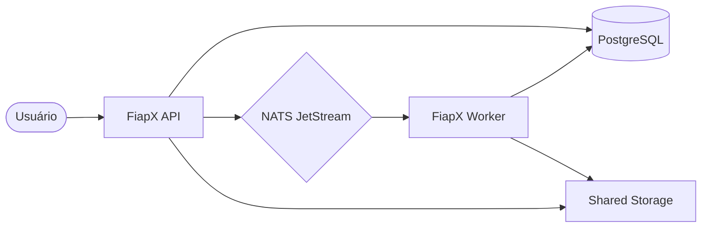

# FiapX Video Processor API

API de alto desempenho para upload de vídeos e processamento assíncrono de extração de frames.

---

## 🏗️ Arquitetura

O projeto utiliza a **Arquitetura Hexagonal (Ports and Adapters)** para garantir desacoplamento, testabilidade e manutenibilidade.

### Visão Geral do Sistema



---

## 🛠️ Stack Tecnológica

| Componente | Tecnologia | Finalidade |
| :--- | :--- | :--- |
| **Linguagem** | Go (1.24+) | Implementação dos serviços |
| **Framework API** | Gin Gonic | API RESTful HTTP |
| **Banco de Dados** | PostgreSQL 15 | Persistência (Usuários, Vídeos) |
| **Mensageria** | NATS JetStream | Comunicação assíncrona orientada a eventos |
| **Processamento** | FFmpeg | Extração de frames de vídeo |
| **Autenticação** | JWT & Bcrypt | Acesso seguro e hash de senhas |
| **Observabilidade** | Prometheus & Grafana | Coleta de métricas e dashboards |
| **Containerização** | Docker & Compose | Orquestração de ambiente |

---

## 📋 Pré-requisitos

- **Docker** e **Docker Compose** instalados.
- (Opcional) **FFmpeg** instalado localmente para desenvolvimento fora do Docker.
- (Opcional) **Go 1.24+** para rodar nativamente.

---

## 🚀 Como Rodar

O projeto utiliza **perfis do Docker Compose** para facilitar a subida de componentes específicos.

### 1. Subir a Infraestrutura (DB, NATS)
```bash
docker-compose --profile api up -d
```
*Isso subirá o banco de dados e o broker de mensagens.*

### 2. Subir Tudo (API, Worker, Monitoramento)
```bash
docker-compose --profile all up -d
```

### 3. Monitoramento
Após subir com o perfil `all` ou `monitor`, acesse:
- **Grafana**: `http://localhost:3000` (User: `admin` / Password: `admin`)
- **VictoriaMetrics**: `http://localhost:8428`

---

## 📍 Endpoints Principais

### Documentação (Swagger)
- **Swagger UI**: `http://localhost:8080/swagger/index.html`

### Autenticação
- `POST /register`: Registro de novo usuário.
- `POST /login`: Login e obtenção de token JWT.

### Vídeos (Requer JWT no Header `Authorization: Bearer <token>`)
- `POST /api/upload`: Upload de vídeo para processamento.
- `GET /api/videos`: Listar vídeos do usuário e seus status.
- `GET /api/status`: Listar todos os arquivos processados (Admin).
- `GET /download/:filename`: Baixar o ZIP com os frames extraídos.

### Observabilidade e Monitoramento
- **Métricas Prometheus**: `http://localhost:8080/metrics`

---

## 📂 Estrutura de Pastas (API)

- `migrations/`: Scripts SQL de migração do banco de dados.
- `internal/core/domain/`: Entidades de negócio puro.
- `internal/core/services/`: Casos de uso e lógica de negócio.
- `internal/core/ports/`: Definição de interfaces.
- `internal/adapters/`: Implementações específicas de infraestrutura (Inbound/Outbound).
